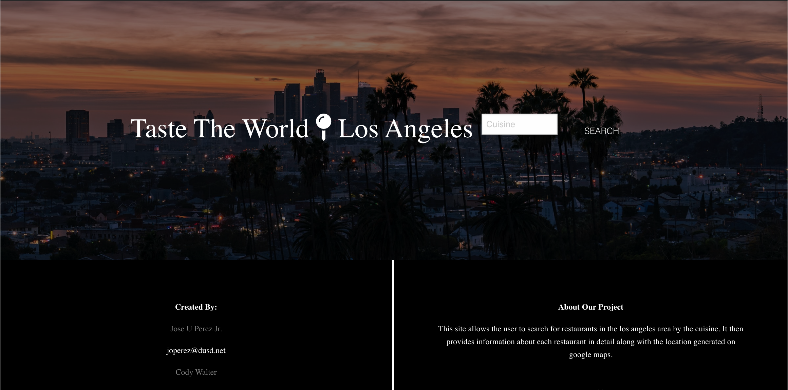
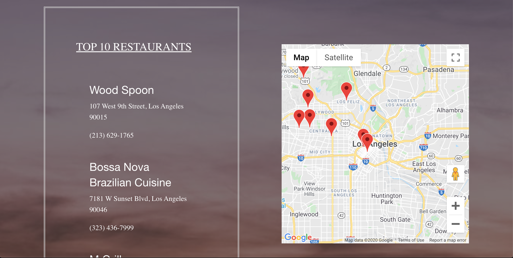
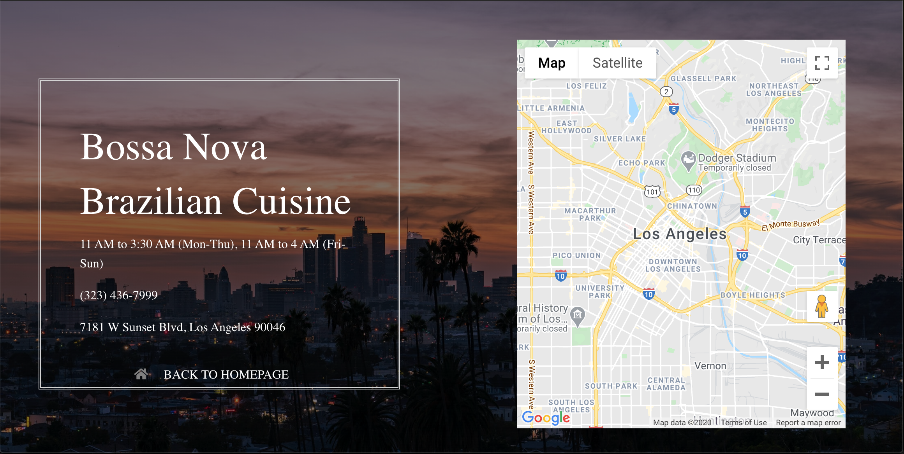

# Project-1

USER STORY:

AS A foodie
I WANT a website that searches the best restaurants by cuisine in LA
SO THAT I can try different cuisines from around the world represented in LA

Description: Our site was created for food enthusiasts who want to explore the many different cuisines present in Los Angeles. Simply choose a cusines that you would like to try and see the top 10 results displayed for you to choose from. Once you decide on a restaurant, select it, and see detailed information about it.

Technologies Used: HTML, CSS, JavaScript, JQuery, Foundation, Zomato API, Google Maps API

